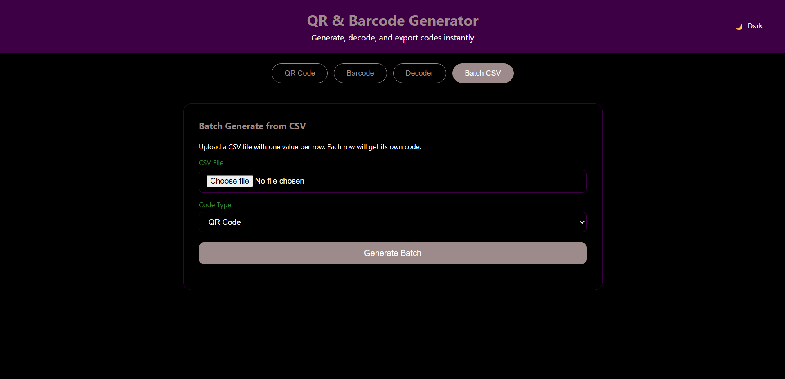
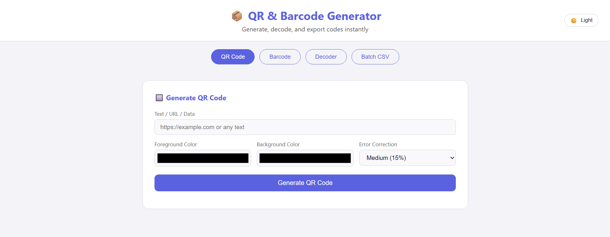

# 📦 QR & Barcode Generator

A full-featured QR code and barcode generator web app built with **Flask** and **Python**. Generate, decode, and export codes with a clean dark/light mode UI.

---

## ✨ Features

- 🔲 **QR Code Generator** — Custom colors, error correction levels
- 📊 **Barcode Generator** — Supports Code128, EAN-13, UPC-A, ISBN-13, Code39
- 🔍 **Decoder** — Upload an image to decode any QR or barcode
- 📋 **Batch Generation** — Upload a CSV file to generate codes in bulk
- ⬇️ **Download** — Export any code as PNG or PDF
- 🌙 **Dark / Light Mode** — Toggle with preference saved in localStorage

---

## 🖥️ Screenshots

> 
> 

---

## 🚀 Getting Started

### Prerequisites

- Python 3.9+
- pip

### Installation

**1. Clone the repository**
```bash
git clone https://github.com/your-username/qr-barcode-generator.git
cd qr-barcode-generator
```

**2. Create a virtual environment**
```bash
python -m venv .venv
```

Activate it:
- **Windows:** `.venv\Scripts\activate`
- **Mac/Linux:** `source .venv/bin/activate`

**3. Install dependencies**
```bash
pip install -r requirements.txt
```

> ⚠️ **Windows users:** `pyzbar` requires the ZBar DLL. Install it with:
> ```bash
> pip install pyzbar[win32]
> ```

**4. Run the app**
```bash
python app.py
```

**5. Open in browser**
```
http://127.0.0.1:5000
```

---

## 📁 Project Structure

```
qr-barcode-generator/
├── app.py                  # Flask backend & API routes
├── requirements.txt        # Python dependencies
├── templates/
│   └── index.html          # Frontend UI
├── static/
│   └── generated/          # Auto-created — saved code images
└── uploads/                # Auto-created — temp uploaded files
```

---

## 🛠️ Tech Stack

| Layer     | Technology              |
|-----------|-------------------------|
| Backend   | Python, Flask           |
| Frontend  | HTML, CSS, JavaScript   |
| QR Codes  | `qrcode`, `Pillow`      |
| Barcodes  | `python-barcode`        |
| Decoding  | `pyzbar`, `OpenCV`      |
| PDF Export| `ReportLab`             |

---

## 📡 API Endpoints

| Method | Endpoint              | Description                        |
|--------|-----------------------|------------------------------------|
| GET    | `/`                   | Serve the main UI                  |
| POST   | `/generate/qr`        | Generate a QR code                 |
| POST   | `/generate/barcode`   | Generate a barcode                 |
| POST   | `/decode`             | Decode a QR/barcode from an image  |
| POST   | `/batch`              | Batch generate from a CSV file     |
| GET    | `/download/png/<file>`| Download a code as PNG             |
| GET    | `/download/pdf/<file>`| Download a code as PDF             |

---

## 📋 Batch CSV Format

Upload a `.csv` file with one value per row:

```
https://github.com
https://google.com
Hello World
product-001
```

Each row generates its own code with a download link.

---

## 📦 Dependencies

```
flask
qrcode[pil]
python-barcode
pillow
pyzbar
opencv-python
reportlab
```

Install all with:
```bash
pip install -r requirements.txt
```

---

## 📄 License

This project is open source and available under the [MIT License](LICENSE).

---

## 👤 Aditya

**Your Name**  
GitHub: [@Adityxax](https://github.com/Adityxax)